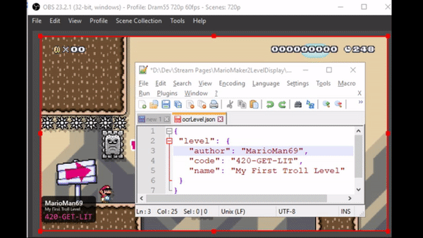

# Mario Maker 2 Level Display
A small web app which can be used to display Mario Maker levels. This can be leveraged with OBS Browser Source to display levels on a Twitch Stream.

Can be used in conjunction with [MarioMaker2OCR](https://github.com/dram55/MarioMaker2OCR) to automatically display levels on stream.

## Setup
- Prerequisite: [Node.js](https://nodejs.org/en/) on your machine
- Download project
- Install browser-sync `npm install browser-sync -g`
- Start browser sync `start-server.cmd`
   - This should start the app on http://localhost:3000/
- In OBS set a Browser source and set the URL to http://localhost:3000/
- Any change to `data\ocrLevel.json` will be reflected in the browser.

